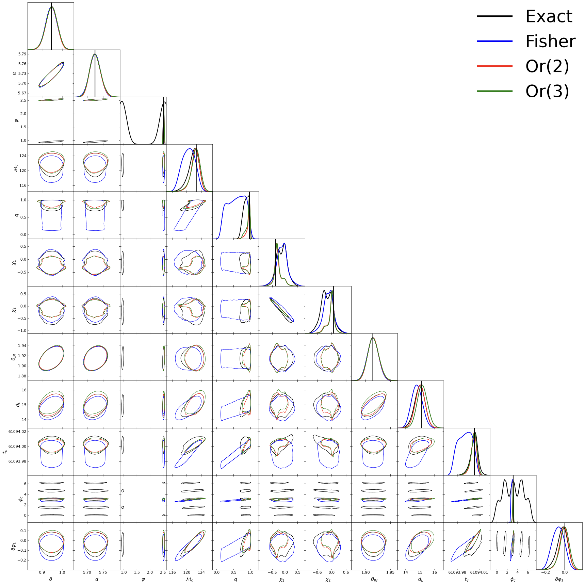

# SymDALI

**SymDALI** is a Wolfram Language (Mathematica) paclet that implements the [DALI](https://arxiv.org/abs/1401.6892) algorithm using symbolic differentiation. It is developed for gravitational-wave (GW) parameter estimation and is the companion code for a paper to be submitted to Physical Review D.

## Overview

The Fisher information matrix gives the Gaussian (quadratic) approximation to the posterior of a GW signal, but it often fails for events with moderate signal-to-noise ratio (SNR) or when posterior distributions are non-Gaussian. DALI (Derivative Approximation for LIkelihoods) systematically extends the Fisher approximation to higher orders in the Taylor expansion of the log-likelihood:

$$\ln \mathcal{L}(\theta) \approx -\frac{1}{2} \Gamma_{ij} \Delta\theta^i \Delta\theta^j - \frac{1}{6} \mathcal{F}_{ijk} \Delta\theta^i \Delta\theta^j \Delta\theta^k - \ldots$$

where $\Gamma_{ij}$ is the Fisher matrix, $\mathcal{F}_{ijk}$ and higher tensors are the DALI coefficients, and $\Delta\theta^i = \theta^i - \theta^i_0$ is the deviation from the fiducial point. The result is a polynomial approximation to the likelihood that can be sampled orders of magnitude faster than the exact likelihood.

The figure below shows an example: exact likelihood (black), Fisher approximation (blue), DALI order 2 (red), and DALI order 3 (green) for a GW event with SNR 109, observed by a network of 2 Einstein Telescope L-shaped detectors and 1 Cosmic Explorer. The DALI order 2 result takes ~15 minutes with [emcee](https://arxiv.org/pdf/1202.3665), while the exact likelihood takes ~13 hours with [nessai](https://arxiv.org/pdf/2102.11056).



## Features

- DALI tensor computation up to order 3 for GW signals
- Waveform models:
  - **IMRPhenomD** (aligned-spin, fully supported)
  - **IMRPhenomHM** (aligned-spin with higher modes, fully supported)
  - **IMRPhenomPv2** (precessing, partially supported)
- GR deviation parameters from the [TIGER](https://arxiv.org/pdf/1311.0420) framework (inspiral δφ_{-2},...,δφ_7; intermediate δβ_2, δβ_3; ringdown δα_2, δα_3, δα_4)
- Detector network support:
  - Current detectors: LIGO H1, L1; Virgo V1; KAGRA K; LIGO India I1
  - Next-generation: Einstein Telescope (triangle and L-shaped at Sardinia and Meuse-Rhine, 10/15/20 km arm lengths), Cosmic Explorer (Idaho and New Mexico)
  - Noise curves: ET-D, CE-20, CE-40, CE-40-lf, CE-20-pm, A+/O5, KAGRA 80 Mpc, Virgo O5
- Signal-to-noise ratio (SNR) computation
- Waveform evaluation (h+ and hx) for IMRPhenomD and IMRPhenomHM
- Pattern function computation including time delay from detector to Earth center
- Population model utilities: Madau-Dickinson star formation, Power-Law+Peak mass distribution (GWTC-3), spin distribution
- Cosmological utilities: comoving distance, differential comoving volume (Planck 2018)

## Requirements

- **Wolfram Mathematica 14.0+**
- **Platform**: macOS ARM64 (Apple Silicon, M1 or later) — Linux and Windows support is planned

## Installation

1. Clone or download this repository.
2. In a Mathematica notebook, load the paclet by pointing to the directory containing `PacletInfo.wl`:

```mathematica
PacletDirectoryLoad["/path/to/SymDALI"];
<< FelipeBarbosa`SymDALI`
```

Alternatively, install it as a paclet:

```mathematica
PacletInstall["/path/to/SymDALI"];
<< FelipeBarbosa`SymDALI`
```

## Quick Start

### DALI Tensors

The main function is `DALITensors`. It takes an approximant name, a fiducial point association, a list of detector associations, and the expansion order.

```mathematica
(* Define detectors *)
det1 = <|
  "Position"    -> DetectorVertex["ET-S"],
  "DetectorTensor" -> DetectorTensor["ET-S-L"],
  "ASD"         -> ASD["ET-10-lfhf"]
|>;

det2 = <|
  "Position"    -> DetectorVertex["CE-I"],
  "DetectorTensor" -> DetectorTensor["CE-I"],
  "ASD"         -> ASD["CE-40"]
|>;

(* Define the fiducial point — all keys are strings *)
fp = <|
  "\[ScriptCapitalM]c" -> 30.0,   (* chirp mass [solar masses] *)
  "\[Delta]"           -> 0.0,    (* mass asymmetry (m1-m2)/(m1+m2), range [0,1) *)
  "\[Chi]s"            -> 0.0,    (* symmetric spin *)
  "\[Chi]a"            -> 0.0,    (* antisymmetric spin *)
  "\[Iota]"            -> 0.4,    (* inclination [radians] *)
  "\[Theta]"           -> 1.2,    (* sky polar angle [radians] *)
  "\[Phi]"             -> 0.8,    (* sky azimuthal angle [radians] *)
  "\[Psi]"             -> 0.3,    (* polarization angle [radians] *)
  "1/dL"               -> 0.2,    (* inverse luminosity distance [1/Gpc] *)
  "tc"                 -> 0.0,    (* coalescence time [s] *)
  "\[Phi]ref"          -> 0.0     (* reference phase [radians] *)
|>;

(* Compute DALI tensors up to order 2 *)
dali = DALITensors["IMRPhenomD", fp, {det1, det2}, 2];
```

The result is a nested list `dali[[i, j]]` where `i` runs from 1 to the expansion order and `j` from 1 to `i`. The diagonal entries `dali[[i, i]]` contain the purely symmetric DALI tensors of order `2i`. The full tensor at order `i+j` mixes gradients of order `i` and `j`.

**Options:**

| Option | Default | Description |
|--------|---------|-------------|
| `"fmin"` | `10` | Minimum frequency [Hz] |
| `"fmax"` | `1024` | Maximum frequency [Hz] (capped at the ISCO) |
| `"res"` | `1000` | Number of frequency points |
| `"AllFisherMatrices"` | `False` | If `True`, return per-detector contributions instead of the network sum |

### Post-processing

```mathematica
(* ProcessDALITensors: LI components with multiplicities, ready for contraction *)
processed = ProcessDALITensors[dali];

(* TaylorForm: totally symmetric tensors organized by rank *)
taylor = TaylorForm[dali];
```

### SNR

```mathematica
snr = SNR["IMRPhenomD", fp, {det1, det2}];
```

### Waveform Evaluation

```mathematica
fvec = Range[10, 512, 0.1];  (* frequency vector [Hz] *)

(* hphcIMRPhenomD returns {{h+}, {hx}} as a matrix with dimensions {2, Length[fvec]} *)
hphc = hphcIMRPhenomD[fvec, Mc, delta, chis, chia, iota, tc, phiref, invdL];

(* With TIGER parameters *)
hphcTIGER = hphcIMRPhenomD[fvec, Mc, delta, chis, chia, iota, tc, phiref, invdL,
  "\[Delta]\[CurlyPhi]-2" -> 0.5, "\[Delta]\[Beta]3" -> 0.1];
```

### Detector Utilities

```mathematica
(* Detector tensor and vertex position *)
Dij = DetectorTensor["ET-S-L"];
pi  = DetectorVertex["ET-S"];

(* Noise curve as InterpolatingFunction *)
Sn = ASD["ET-10-lfhf"];
Sn[100]  (* ASD at 100 Hz *)

(* Pattern functions *)
{Fp, Fx} = PatternFunctions[fvec, delta, alpha, psi, GMST, pi, Dij];
```

### Population Utilities

```mathematica
(* Comoving distance (InterpolatingFunction) *)
Dc = ComovingDistance[];

(* Differential comoving volume (InterpolatingFunction) *)
dVcdz = DifferentialComovingVolume[];

(* Power-Law+Peak mass distribution (GWTC-3 hyperparameters) *)
p = PowerLawPlusPeak[m1, q];

(* Madau-Dickinson star formation rate *)
psi = MadauDickinsonProfile[z];

(* Spin distribution *)
p = SpinDistribution[chi1, chi2, costheta1, costheta2];
```

## Package Structure

```
SymDALI/
├── PacletInfo.wl                  # Paclet metadata
├── Kernel/
│   ├── SymDALI.wl                 # Entry point, loads subpackages
│   ├── DALICoefficients.wl        # Core DALI tensor computation (DALITensors)
│   ├── DerivativeTools.wl         # Symbolic differentiation engine
│   ├── Detectors.wl               # Detector tensors, vertices, and ASDs
│   ├── DALIPolynomial.wl          # Post-processing (TaylorForm, ProcessDALITensors)
│   ├── Population.wl              # Population distributions and cosmology
│   └── Utils.wl                   # SNR, waveform evaluation, pattern functions
├── Rules/
│   ├── IMRPhenomD/                # Pre-computed derivative rules for IMRPhenomD
│   ├── IMRPhenomHM/               # Pre-computed derivative rules for IMRPhenomHM
│   └── IMRPhenomPV2/              # Pre-computed derivative rules for IMRPhenomPv2
├── LibraryResources/
│   └── MacOSX-ARM64/
│       ├── DerivativeRules/       # Compiled C libraries (.dylib) for fast evaluation
│       └── Polynomial_Functions/  # Compiled DALI polynomial evaluator
├── Data/
│   └── ASD/                       # Noise curves for current and next-gen detectors
├── Documentation/
│   └── English/                   # Reference pages for public symbols
└── Demo/
    ├── UserGuide.wl               # Usage examples
    └── Overplot.pdf               # Example figure
```

## Key Design Decisions

**Symbolic differentiation with compiled evaluation.** The derivatives of the waveform amplitude and phase with respect to all parameters are computed once symbolically (using `DerivativeRules`) and saved to disk. At runtime, these are loaded as compiled C library functions (`LibraryLink`), allowing fast numerical evaluation without repeating the expensive symbolic computation.

**Factored gradient structure.** The signal in detector `d` is `s_d(f) = F_+^d h_+(f) + F_x^d h_x(f)`. The gradient of `s_d` is computed by separately differentiating the pattern functions `(F_+, F_x)` with respect to sky and orientation angles, and the polarizations `(h_+, h_x)` with respect to intrinsic parameters. These are then combined via the chain rule.

**SymmetrizedArray tensors.** All DALI tensors are inherently totally symmetric. Mathematica's `SymmetrizedArray` objects are used to store and manipulate them efficiently, keeping only the linearly independent (LI) components.

## Citation

If you use SymDALI in your research, please cite the companion paper (reference to be added upon publication) and the original DALI paper:

- Sellentin, Heavens & Jasche (2014), [arXiv:1401.6892](https://arxiv.org/abs/1401.6892)

## License

MIT License. See [LICENSE](LICENSE) for details.


## Acknowledgements

- [gwfast](https://arxiv.org/abs/2203.02670) — inspiration and cross-validation
- [emcee](https://arxiv.org/pdf/1202.3665) — MCMC sampling used in examples
- [nessai](https://arxiv.org/pdf/2102.11056) — nested sampling used in examples
- Detector sensitivity curves from the [Einstein Telescope](https://www.et-gw.eu) and [Cosmic Explorer](https://cosmicexplorer.org) projects

This work is supported by FAPES-Brazil